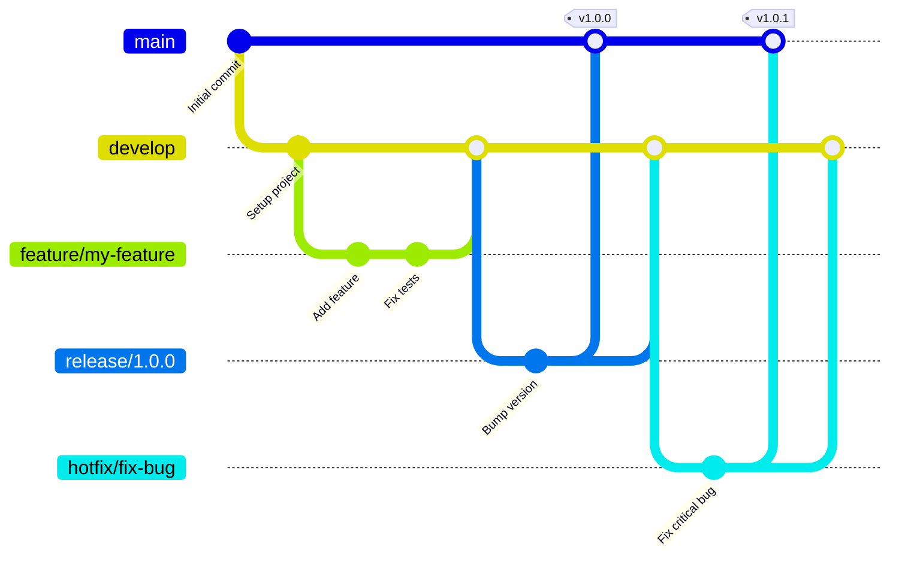

# Git Flow ガイド

Git Flow は、Git を用いたブランチ管理のベストプラクティスの一つです。以下に基本的な Git Flow の使用方法とコマンドを解説します。

## ブランチ構造



## ブランチの種類

1. **master**: リリース可能な状態のブランチ。
2. **develop**: 次のリリースの開発が行われるブランチ。
3. **feature**: 新機能の開発が行われるブランチ。`develop`から分岐。
4. **release**: リリース準備が行われるブランチ。`develop`から分岐。
5. **hotfix**: リリース済みのバージョンに対する緊急修正が行われるブランチ。`master`から分岐。

## Git Flow のインストール

まず、Git Flow をインストールします。

### macOS

```bash
brew install git-flow
```

### Ubuntu

```bash
sudo apt-get install git-flow
```

## Git Flow の初期化

新しいリポジトリで Git Flow を初期化します。

```bash
git flow init
```

## Feature ブランチの作成

新機能の開発を開始するために、`develop`ブランチから feature ブランチを作成します。

```bash
git flow feature start my-feature
```

開発が完了したら、feature ブランチを`develop`にマージします。

```bash
git flow feature finish my-feature
```

## Release ブランチの作成

リリース準備を開始するために、`develop`ブランチから release ブランチを作成します。

```bash
git flow release start 1.0.0
```

リリース準備が完了したら、release ブランチを`master`と`develop`にマージします。

```bash
git flow release finish 1.0.0
```

## Hotfix ブランチの作成

リリース後の緊急修正を行うために、`master`ブランチから hotfix ブランチを作成します。

```bash
git flow hotfix start fix-bug
```

修正が完了したら、hotfix ブランチを`master`と`develop`にマージします。

```bash
git flow hotfix finish fix-bug
```

以上が基本的な Git Flow の使用方法です。

- [link](https://example.com)
- https://example.com


